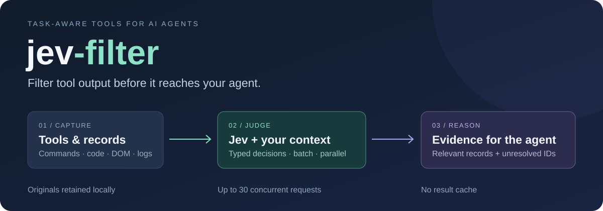
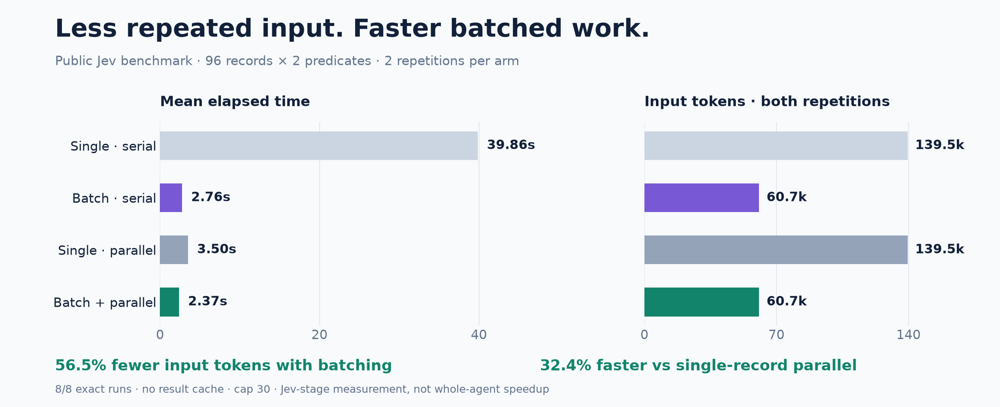

<p align="center">
  
</p>

<p align="center">
  <a href="README.zh-CN.md">简体中文</a> · <a href="#quick-start">Quick start</a> · <a href="#connect-your-agent">Agent setup</a> · <a href="docs/benchmarks.md">Benchmarks</a> · <a href="https://github.com/apixly-ai/jev-context/releases">Releases</a>
</p>
<p align="center">
  <a href="https://github.com/apixly-ai/jev-context/actions/workflows/ci.yml"></a>
  <a href="https://github.com/apixly-ai/jev-context/releases"></a>
  <a href="LICENSE"></a>
</p>

**A semantic filter between your tools and your AI agent.** Capture command output, search results, browser controls or logs inside the CLI. Let Jev judge them using the agent's task and context. Return relevant evidence and unresolved IDs instead of an entire raw dump.

## Why Jev Context?

- **Send less context to the primary agent.** Filter before raw output enters the conversation; recover originals by ID. Historical workflows returned **88–97% less context**. [Evidence and trade-offs →](docs/benchmarks.md#historical-prototype-primary-agent-workflow-comparison)
- **Spend less on repeated Jev input.** Automatic packing plus up to 30 concurrent requests. The public benchmark used **56.5% fewer input tokens** and ran **32.4% faster** than single-record parallel calls. [Reproduce →](docs/benchmarks.md#public-package-measured-2026-09-22)
- **Keep decisions inspectable.** The agent controls the context, questions and output; missing facts remain `REVIEW`. **8/8 exact fixture runs**, plus three installed workflow acceptance checks. [Public data](benchmarks/results/2026-09-22-live.json) · [Integration evidence](benchmarks/results/2026-09-22-migration.json)

Use it for **many records + repeated semantic judgment + clear criteria**. Use native tools for exact paths, IDs, selectors, calculations and short results. Keep open-ended reasoning and writing in your primary model.

## Measured, not assumed



96 synthetic records, two predicates per record, two runs per arm. All eight runs matched the expected selections. These numbers measure the **Jev stage**, not an entire agent task. [Raw results](benchmarks/results/2026-09-22-live.json) · [Method and rerun command](docs/benchmarks.md)

**What about total cost?** Historical primary-agent A/Bs estimated 4–25% lower cold API-equivalent cost, but all three workflows were 1.5–10.2% slower. The standalone migration also had a small-batch slowdown with unchanged token usage. We retain those results in the report. Smaller context is an opportunity to save—not a guarantee.

## Quick start

**Node.js 22+ · macOS or Linux · no separate Python setup for the npm distribution.** Windows users can use WSL. A TypeSafe Jev API key is needed only for inference.

Install from npm:

```sh
npm install -g @apixly/jev-context
jev-context doctor
```


Set your key, then try a self-contained example from **any directory**:

```sh
export TYPESAFE_API_KEY='your-key'

jev-context query --input - --mode choose \
  --task 'Choose the record showing a CURRENT unresolved DNS failure' <<'JSON'
[
  {"id":"a","text":"The previous DNS failure recovered; requests now succeed."},
  {"id":"b","text":"DNS lookup still fails; no connection can be established."}
]
JSON
```

Expected selection, with metadata omitted here:

```json
{"selected_ids":["b"],"review_ids":[],"complete":true}
```

Small examples teach the interface; native tools are usually better for inputs this short. For real workloads, let the CLI collect the data itself:

```sh
# Run your trusted collector once; its full output stays inside the program.
jev-context exec --task 'Find unresolved network failures' \
  --analysis analysis.json -- your-collector --json
```

Start from [a copyable analysis contract](docs/recipes.md#1-custom-command-output), then replace the collector. `exec` passes an argument array without an implicit shell. [Read output and exit codes →](docs/getting-started.md#read-the-result)

## Connect your agent

The CLI works with any agent that can execute commands. It is not a separate agent or a required MCP server.

**1. Install the skill.** After a global npm install, for Codex:

```sh
mkdir -p ~/.codex/skills
cp -R "$(npm root -g)/@apixly/jev-context/skills/jev-context" ~/.codex/skills/
```

For another agent, copy the same skill into its supported skill directory. [Claude Code and generic harness setup →](docs/agents.md)

**2. Give the agent this routing rule.**

```text
Use jev-context when many records need a clear semantic judgment.
Pass the task, scope, exclusions, success criteria and sourced facts.
Keep collection → analysis → compact output inside one tool call.
Inspect unresolved IDs; do not repeat settled judgments or wrap an
existing Jev workflow again. Use native tools for exact or short work.
```

**3. Supply context that changes the answer.** Jev does not inherit the agent's chat. Put shared facts in `context`, record history on each record, and declare required fields. The agent controls questions, filtering, ranking and output projection. [Complete integration guide →](docs/agents.md) · [Context contract →](docs/context-contract.md)

## Choose the right entrypoint

| You have… | Use | Start here |
|---|---|---|
| A custom command that produces lots of results | `exec` | [Collector recipe](docs/recipes.md#1-custom-command-output) |
| JSON candidate records | `query` | [Selection recipe](docs/recipes.md#2-select-with-context) |
| Source code matching a broad lexical query | `code-search` | [Code recipe](docs/recipes.md#3-search-whole-code-symbols) |
| A local Camofox page with many controls | `locate` | [Browser recipe](docs/recipes.md#4-find-a-browser-control) |
| JSON/JSONL events across many requests | `triage` | [Log recipe](docs/recipes.md#5-triage-correlated-events) |
| An existing typed Jev workflow | Python `batch.run` or CLI `batch` | [Library integration](docs/agents.md#python-workflows) |

[All flags and limits](docs/cli.md) · [Original evidence by ID](docs/getting-started.md#read-the-result) · [Architecture](docs/architecture.md)

## Built for real use

We use Jev Context in our own environment. Source annotation, Telegram maintenance planning and SRE routing retain their existing contracts and pass synthetic acceptance using real Jev calls. Private identities, credentials and production data are excluded from this repository.

- **No result cache.** Explicit context, bounded collection, retained failures and reported usage.
- **Protected releases.** Required CI/security checks, immutable release tags, checksums and build provenance.
- **Portable core.** Python library plus npm CLI distribution; automatic batching, maximum 30 requests in flight.
- **Transparent boundaries.** Inputs used for inference are sent to TypeSafe. `exec` runs your command and is not a sandbox. Selection does not authorize actions. [Security →](SECURITY.md)

## Contribute

```sh
git clone https://github.com/apixly-ai/jev-context.git
cd jev-context
python -m venv .venv && . .venv/bin/activate
python -m pip install -e '.[code,dev]'
sh scripts/check.sh
npm test
```

[Contributing](CONTRIBUTING.md) · [Development and releases](docs/development.md) · [Governance](GOVERNANCE.md) · [Changelog](CHANGELOG.md) · [Report a bug](https://github.com/apixly-ai/jev-context/issues/new/choose)

Maintained by **Apixly / JIA-ss** · [MIT](LICENSE) · Independent of TypeSafe.
