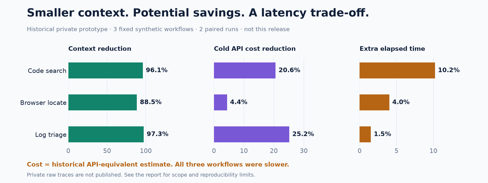

# Benchmarks

[简体中文](benchmarks.zh-CN.md)

## Whole-operation benchmark: 48 agent runs


[Per-run JSON](../benchmarks/results/2026-09-23-operations.json) · [CSV](../benchmarks/results/2026-09-23-operations.csv) · [Aggregates](../benchmarks/results/2026-09-23-operations-summary.json) · [Typed decision evidence](../benchmarks/results/2026-09-23-decisions.json)

This is a fresh benchmark of the public core: **two primary models, four scenarios,
raw/filtered arms and three repetitions = 48 real agent operations**. The primary
agent invoked the same fixed collector exactly once, consumed its output and returned
structured selected IDs. Each model used medium reasoning. Arm order alternated;
each model lane ran serially, with two model lanes active. No Jev result cache was used.

Timing includes the tool call, any Jev inference, the primary model's continuation and
the final browser freshness guard. Browser/page setup is recorded separately and
excluded because the measured locator operation assumes an existing page. This
compares a fixed candidate stream, not unrestricted agents choosing different tools.

Positive cost/latency changes below mean **more expensive/slower**. Context is returned
tool-output characters, not total primary-model tokens.

| Primary model | Scenario | Context reduction | Cold API cost change | Latency change | Raw/filtered complete |
|---|---|---:|---:|---:|---:|
| Astra | code-search | 96.3% | -18.0% | -2.4% | 2/3 → 3/3 |
| Astra | locate | 88.5% | -3.7% | -4.0% | 3/3 → 3/3 |
| Astra | triage | 97.3% | -20.8% | +16.5% | 0/3 → 3/3 |
| Astra | exec | 91.6% | -3.6% | +10.2% | 3/3 → 3/3 |
| Luna | code-search | 96.3% | -10.6% | -4.3% | 3/3 → 3/3 |
| Luna | locate | 88.5% | -2.5% | +43.0% | 3/3 → 3/3 |
| Luna | triage | 97.3% | -2.4% | +27.3% | 3/3 → 3/3 |
| Luna | exec | 91.6% | +0.6% | +3.0% | 3/3 → 3/3 |


**Quality:** all 48 runs selected the expected ID sets, with no observed false additions
or omissions. Four raw Astra runs additionally requested review (one code and three
log runs); all 24 filtered runs finished without review. This is reported separately
from ID correctness. Fewer reviews do not prove better calibration on unseen inputs.
All 48 operations were protocol-valid and reported complete model usage.

**Measurement limits:** two raw command events omitted `aggregated_output` from the
Codex event stream. Their character lengths are null, not zero; no values were imputed.
Context means use the available measurements (2 or 3 per arm). Timing, quality and
usage remain available. Three repetitions per cell are too few for strong statistical
claims. The report includes mean, median, observed min/max and sample counts; it does
not present a noisy p95 as a production guarantee.

**Cost:** estimates use standard, short-context USD rates verified on 2026-09-23:
[Astra](https://developers.openai.com/api/docs/models/gpt-6-astra) input/cached input/output
$10/$1/$50 per million tokens;
[Luna](https://developers.openai.com/api/docs/models/gpt-5.6-luna) $0.20/$0.02/$1.20;
[Jev](https://typesafe.ai/blog/introducing-system-one-models-and-jev) $0.042 input and free
output. Both cold and cache-adjusted estimates are retained. Cache-write charges,
regional surcharges, service tiers and discounts are not modeled. These are
**API-equivalent estimates, not the owner's subscription invoice**.

The Luna command scenario was **0.6% more expensive** after adding Jev. Several filtered
scenarios were slower, including Luna browser selection (+43.0%). Use the tool when
context pressure or a measured workload justifies it; do not force it onto cheap,
small or latency-sensitive tasks.

### Absolute values and timing distribution

Each cell uses three runs. Arrows show raw → filtered; times are seconds and costs are API-equivalent USD per operation.

| Model / scenario | Mean time | Median time | Observed range: raw; filtered | Cold API-equivalent cost |
|---|---:|---:|---|---:|
| Astra / code-search | 22.01 → 21.49 | 22.10 → 20.88 | 19.24–24.68; 20.55–23.04 | $0.65282 → $0.53527 |
| Astra / locate | 19.19 → 18.43 | 19.42 → 18.46 | 18.11–20.05; 17.73–19.10 | $0.55392 → $0.53335 |
| Astra / triage | 20.85 → 24.30 | 20.50 → 24.88 | 20.39–21.66; 21.22–26.79 | $0.67587 → $0.53502 |
| Astra / exec | 19.42 → 21.39 | 20.55 → 22.00 | 17.01–20.69; 19.27–22.89 | $0.55358 → $0.53365 |
| Luna / code-search | 21.91 → 20.97 | 21.14 → 20.40 | 18.98–25.60; 17.63–24.87 | $0.01202 → $0.01075 |
| Luna / locate | 17.12 → 24.47 | 17.35 → 17.52 | 16.54–17.46; 16.41–39.49 | $0.01025 → $0.01000 |
| Luna / triage | 20.87 → 26.57 | 20.91 → 19.88 | 19.04–22.66; 19.66–40.17 | $0.01179 → $0.01150 |
| Luna / exec | 19.42 → 20.01 | 18.83 → 20.59 | 17.30–22.12; 16.55–22.87 | $0.01029 → $0.01035 |

The Luna browser mean is affected by one 39.49-second sample. Its filtered median is about 17.52 seconds versus 17.35 raw; the three-run mean is not a stable production latency estimate.

### Reproduce the complete workflow

Requires a compatible Codex CLI authenticated to your own account, Jev credentials,
and a local Camofox server on port 9377 for the browser scenario. The harness creates
only synthetic fixtures and its own browser sessions; it does not click or send messages.

```sh
python -m benchmarks.operations --live \
  --codex "$(command -v codex)" \
  --models gpt-6-astra gpt-5.6-luna --repeats 3 \
  --report local-results/operations.json \
  --private-dir /tmp/jev-filter-operations-unique
```

Use fresh paths. This makes 48 primary-agent calls plus the filtered Jev steps and
consumes account usage. Raw agent events remain private outside the repository;
only allowlisted metrics and synthetic typed answers are exported. The report includes
fixture and runtime hashes. Inputs/gold construction live in
[scenarios.py](../benchmarks/scenarios.py); the full driver is
[operations.py](../benchmarks/operations.py).


## Public package: measured 2026-09-22

[Machine-readable results](../benchmarks/results/2026-09-22-live.json),
[fixture](../benchmarks/fixture.py), [runner](../benchmarks/run.py).

96 synthetic service records, two atomic predicates each, Jev `jev-1.13.0`,
two repetitions per arm with reversed order on repetition two. No result cache.
Wall time includes planning, network, validation and result restoration, but excludes
launching the Python interpreter and downstream primary-agent reasoning.

| Jev execution | Mean seconds | Input tokens, both repetitions | Exact complete runs |
|---|---:|---:|---:|
| Single-record serial | 39.859 | 139,496 | 2/2 |
| Automatic batching, serial | 2.757 | 60,724 | 2/2 |
| Single-record parallel, cap 30 | 3.502 | 139,496 | 2/2 |
| Automatic batching + parallel, cap 30 | 2.368 | 60,724 | 2/2 |

Batching reduced input tokens **56.47%**. Batch + parallel was **32.37% faster than
single-record parallel** and **94.06% faster than single-record serial** in this run.
All runs returned the expected selected IDs with no unresolved records; usage was
reported complete. The result file retains usage, request counts, workers and timings.
These are API-reported tokens, not estimated character counts.

Two runs are a smoke benchmark, not a statistically powered study. Inputs repeat eight
record patterns and are easier than open-world tasks. Network variation is significant;
serial batching was faster than single-record parallel here. A cap of 30 is an upper
bound, not a claim that every request used 30 workers or that 30 is always optimal.


## Historical prototype: primary-agent workflow comparison

Before this standalone package was extracted, a private prototype was tested on
fixed synthetic code-search, browser-control and incident-triage candidates. Two paired
runs used an Astra/medium primary-agent baseline. The following numeric observations
are historical, not measurements of this release. Private full traces are not shipped
because they contain local environment and agent configuration. They therefore have
less public reproducibility than the fresh benchmark above.

| Prototype workflow | Returned context reduction | Cold API-equivalent cost reduction | Total latency change |
|---|---:|---:|---:|
| Code search | 96.13% | 20.58% | **+10.21% slower** |
| Browser control selection | 88.47% | 4.37% | **+4.02% slower** |
| Incident triage | 97.26% | 25.18% | **+1.52% slower** |

Selected IDs matched the expected answers in these fixtures; the raw triage arm also
returned an extra review. The cost figures include the extra Jev step and the primary
model's observed input/output under the historical cold-token price assumptions.
They are API-equivalent estimates, not subscription bills or evidence of money saved
on this particular account. They are not current provider price quotes.


## Reproduce and price your own workload

```sh
python -m pip install -e '.[code,dev]'
python -m benchmarks.run --output local-results/offline-new.json
# Billable; uses configured Jev credentials and never caches results.
python -m benchmarks.run --live --output local-results/live-new.json
```

Each output path must be new so an old or failed run is not overwritten. The offline
mode measures planning only; it is not evidence of model quality or live latency.

For a downstream agent A/B, keep the primary model, reasoning setting, task, candidate
corpus and expected answers fixed. Alternate raw-native and filtered arms; include
collection, Jev, retries, main-agent continuation and any evidence rereads in elapsed
time and usage. Record incomplete/review/failed runs, exact selection or task success,
false omissions, returned context bytes/tokens and input/output tokens **per model**.
A smaller packet alone is not a quality or cost result.

Use your provider's current prices (including cached-input rates where applicable):

```
raw_cost = main_input * main_input_rate + main_output * main_output_rate
filtered_cost = filtered_main_input * main_input_rate
              + filtered_main_output * main_output_rate
              + jev_input * jev_input_rate + jev_output * jev_output_rate
```

Rates must use the same currency and token unit. Include retries and evidence rereads.
If usage is incomplete, label cost as a lower bound. Report both negative and positive
results. Cheap primary models, small inputs, poor context or frequent rereads can erase
the saving. No fixed dollar claim is inferred from the public model-layer benchmark.


## First-user integration acceptance

[Sanitized observations](../benchmarks/results/2026-09-22-migration.json) cover the
maintainer's installed source annotation, Telegram maintenance planning and SRE
routing entrypoints with synthetic data and real Jev calls. All three preserved their
expected decisions and withheld raw input from the compact packet. No message was
sent and no production action was authorized by the test. Existing workflow scripts,
identities and fallback contracts remain private and unchanged.

A separate two-repetition migration A/B used 48 synthetic DNS signals and included
Python process startup: the legacy backend averaged **1.413 s**, the public package
**1.797 s** (**27.2% slower**). Both returned 48/48 correct decisions on each run and
identical usage (6,752 input + 1,913 output tokens per run). No raw signals were in
the returned packet. This small test establishes compatibility, **not a migration
speedup**. The isolated package boundary and transport differ; two runs cannot
attribute the difference to one cause. The privacy-preserving integration bridge
adds a subprocess per whole batch, not per record.


## Visual summary




Charts are rendered by `python scripts/render_assets.py` with the `docs` extra.
The public chart reads the checked-in JSON directly. Historical chart values are
explicitly labeled prototype observations. Neither illustration claims a general
accuracy guarantee or a measured whole-agent speedup for this release.


## Native distribution parity

[Source/native observations](../benchmarks/results/2026-09-23-distribution.json) compare
32 synthetic DNS signals across two alternating-order runs, including process startup
and network inference. All four runs returned 32/32 expected judgments with exactly
4,583 input and 1,273 output tokens per run. Returned JSON was 5,660–5,661 characters
in both arms. The native executable averaged 1.838 s versus Python's 1.178 s;
the individual native runs were 2.570 s and 1.105 s. This small sample does not isolate
startup from network variance and does not demonstrate a native speedup.

The native bundle removes installation prerequisites while preserving decisions and
model usage in this fixture. It does not reduce inference cost by itself. The Node
launcher is separately tested through real tarball installation; this timing compares
the underlying native executable, not the extra Node launcher or npm installation.

```sh
python -m benchmarks.distribution --live \
  --native /path/to/native/jev-filter \
  --output local-results/distribution-new.json
```

