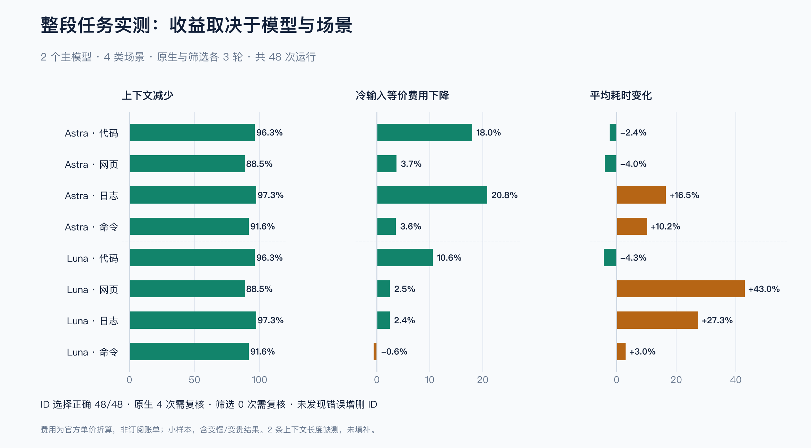
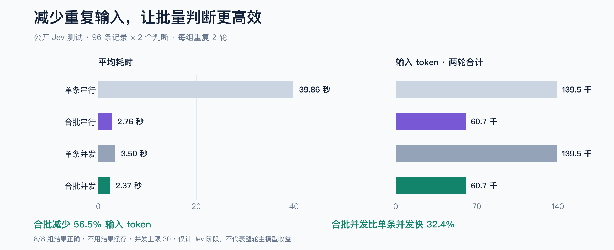
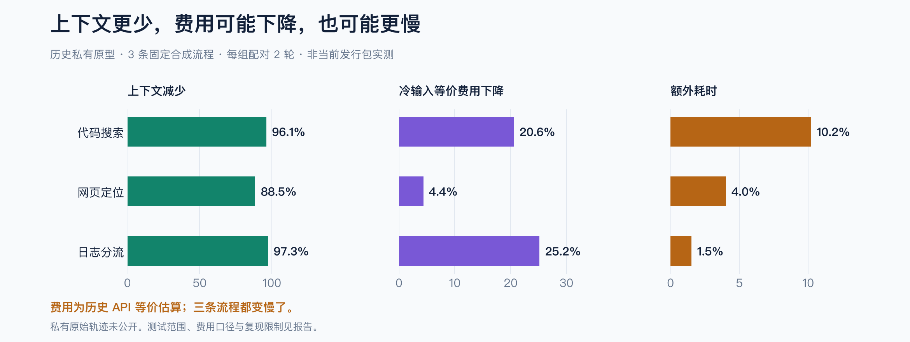

# 性能、费用与质量测试

[English](benchmarks.md) · [中文文档首页](index.zh-CN.md)

## 整段任务测试：48 次真实 agent 运行



[逐次 JSON](../benchmarks/results/2026-09-23-operations.json) · [CSV](../benchmarks/results/2026-09-23-operations.csv) · [汇总数据](../benchmarks/results/2026-09-23-operations-summary.json) · [类型化判断证据](../benchmarks/results/2026-09-23-decisions.json)

这是公开内核的新测试：**两个主模型 × 四类场景 × 原生/筛选两组 × 三轮，共 48 次真实运行**。
主模型实际调用一次固定采集器，读取结果并输出结构化 ID。两个模型都使用 medium 推理，
每个模型内部串行运行、交替测试顺序，两个模型同时进行；Jev 不使用结果缓存。

计时包含工具调用、Jev 判断、主模型续跑和最终网页目标校验。页面创建单独记录但不计入，
因为定位任务从已有页面开始。本实验固定了候选来源，不代表允许 agent 自由选择各种工具的最优表现。

下表费用和耗时的正数表示**更贵/更慢**。上下文指返回工具结果的字符数，不是主模型全部输入 token。

| 主模型 | 场景 | 上下文减少 | 冷输入等价费用变化 | 耗时变化 | 原生/筛选无复核完成 |
|---|---|---:|---:|---:|---:|
| Astra | 代码搜索 | 96.3% | -18.0% | -2.4% | 2/3 → 3/3 |
| Astra | 网页定位 | 88.5% | -3.7% | -4.0% | 3/3 → 3/3 |
| Astra | 日志分流 | 97.3% | -20.8% | +16.5% | 0/3 → 3/3 |
| Astra | 自定义命令 | 91.6% | -3.6% | +10.2% | 3/3 → 3/3 |
| Luna | 代码搜索 | 96.3% | -10.6% | -4.3% | 3/3 → 3/3 |
| Luna | 网页定位 | 88.5% | -2.5% | +43.0% | 3/3 → 3/3 |
| Luna | 日志分流 | 97.3% | -2.4% | +27.3% | 3/3 → 3/3 |
| Luna | 自定义命令 | 91.6% | +0.6% | +3.0% | 3/3 → 3/3 |


**质量：**48 次均选对预期 ID 集合，没有观测到误增或漏选。原生 Astra 的四次运行额外要求复核，
其中代码一次、日志三次；24 次筛选组均无需复核完成。选对 ID 和无需复核完成分开统计，
更少复核不能证明未知数据上的置信度更准确。48 次均符合实验调用协议，模型用量报告完整。

**缺测与样本限制：**两次原生调用的 Codex 事件没有记录 `aggregated_output`，字符长度标为 null，
没有当成零或填补数据。上下文均值采用可用的两或三次测量；耗时、质量和用量仍完整。
每格三轮不足以形成强统计结论，因此提供均值、中位数、观测最小/最大值和样本量，不将不稳定的 p95
包装成生产保证。

**费用口径：**2026-09-23 核对的标准、短上下文美元单价，每百万 token：
[Astra](https://developers.openai.com/api/docs/models/gpt-6-astra) 输入/缓存输入/输出为 $10/$1/$50；
[Luna](https://developers.openai.com/api/docs/models/gpt-5.6-luna) 为 $0.20/$0.02/$1.20；
[Jev](https://typesafe.ai/blog/introducing-system-one-models-and-jev) 输入 $0.042，输出免费。
保留冷输入和缓存调整两种估算，没有计入缓存写入、地区附加费、服务等级或折扣。
**这是 API 等价费用，不是当前账号的订阅账单。**

Luna 的自定义命令场景加上 Jev 后 **贵了 0.6%**。多个场景变慢，其中 Luna 网页选择慢了 43.0%。
适合在上下文压力大或已有实测收益的场景按需使用，不强制用于便宜主模型、少量输入或延迟敏感任务。

### 绝对值与耗时分布

下表每项按三轮统计，箭头为原生 → 筛选；时间单位为秒，费用为每次操作的美元等价估算。

| 模型 / 场景 | 平均耗时 | 中位耗时 | 观测范围：原生；筛选 | 冷输入等价费用 |
|---|---:|---:|---|---:|
| Astra / 代码 | 22.01 → 21.49 | 22.10 → 20.88 | 19.24–24.68; 20.55–23.04 | $0.65282 → $0.53527 |
| Astra / 网页 | 19.19 → 18.43 | 19.42 → 18.46 | 18.11–20.05; 17.73–19.10 | $0.55392 → $0.53335 |
| Astra / 日志 | 20.85 → 24.30 | 20.50 → 24.88 | 20.39–21.66; 21.22–26.79 | $0.67587 → $0.53502 |
| Astra / 命令 | 19.42 → 21.39 | 20.55 → 22.00 | 17.01–20.69; 19.27–22.89 | $0.55358 → $0.53365 |
| Luna / 代码 | 21.91 → 20.97 | 21.14 → 20.40 | 18.98–25.60; 17.63–24.87 | $0.01202 → $0.01075 |
| Luna / 网页 | 17.12 → 24.47 | 17.35 → 17.52 | 16.54–17.46; 16.41–39.49 | $0.01025 → $0.01000 |
| Luna / 日志 | 20.87 → 26.57 | 20.91 → 19.88 | 19.04–22.66; 19.66–40.17 | $0.01179 → $0.01150 |
| Luna / 命令 | 19.42 → 20.01 | 18.83 → 20.59 | 17.30–22.12; 16.55–22.87 | $0.01029 → $0.01035 |

Luna 网页筛选的均值受一次 39.49 秒样本影响；中位数约 17.52 秒，原生约 17.35 秒。不要把三轮均值当成稳定生产延迟。

### 复现整段流程

需要已登录本人账号的兼容 Codex CLI、Jev key，以及 9377 端口的本地 Camofox 服务。
脚本只创建自己的合成数据和浏览器会话，不点击或发送消息。

```sh
python -m benchmarks.operations --live \
  --codex "$(command -v codex)" \
  --models gpt-6-astra gpt-5.6-luna --repeats 3 \
  --report local-results/operations.json \
  --private-dir /tmp/jev-filter-operations-unique
```

使用新路径。这会消耗 48 次主模型任务及相应 Jev 调用的账号用量。
原始 agent 事件保存在仓库之外的私有目录，只导出允许字段中的统计与合成判断。
报告包含数据集和运行时代码哈希。[数据构造](../benchmarks/scenarios.py) · [完整驱动](../benchmarks/operations.py)。


## 核心结论

- 自动合批减少重复上下文，公开测试中的 Jev 输入 token 减少 **56.47%**。
- 合批加并发平均 **2.368 秒**，比单条并发快 **32.37%**；这是 Jev 阶段，不是整轮主模型任务。
- 历史主模型流程的上下文减少 **88–97%**，费用估算下降，但三个流程都更慢。
- 独立包和原生发行包的迁移测试保留了判断结果和用量，也保留了耗时变差的样本。

## 公开版本：2026-09-22 实测



[原始数据](../benchmarks/results/2026-09-22-live.json) · [合成数据集](../benchmarks/fixture.py) · [运行脚本](../benchmarks/run.py)

96 条合成服务记录，每条两个独立判断；模型为 `jev-1.13.0`。四种方式各运行两次，
第二轮反转顺序，不使用结果缓存。耗时包含规划、网络、响应校验和结果恢复，
不包含启动 Python 解释器和主模型后续推理。

| Jev 执行方式 | 平均耗时 | 两轮输入 token 合计 | 完整且正确的轮数 |
|---|---:|---:|---:|
| 单条串行 | 39.859 秒 | 139,496 | 2/2 |
| 自动合批、串行 | 2.757 秒 | 60,724 | 2/2 |
| 单条并发，上限 30 | 3.502 秒 | 139,496 | 2/2 |
| 自动合批并发，上限 30 | 2.368 秒 | 60,724 | 2/2 |

合批减少 **56.47%** 输入 token；合批并发比单条并发快 **32.37%**，比单条串行快 **94.06%**。
八轮均选中预期 ID，没有待复核项，用量报告完整。数据来自 API 返回的 token，不是按字符数估算。

两轮属于小规模验证，不能当成统计充分的研究。记录重复了八种模式，比真实开放任务容易；
网络波动明显。本次合批串行也比单条并发更快。30 是并发上限，不代表每轮都用了 30 个请求，
更不代表 30 对所有负载最优。

## 历史原型：主模型整段流程对比



这些数据来自独立包提取前的私有原型：固定的合成代码、浏览器控件和日志候选，
每组两轮配对，主模型为 Astra/medium。**它们不是本次公开发行包的端到端实测。**
私有完整轨迹包含本地环境与代理配置，未公开，因此可复现程度低于上面的公开测试。

| 流程 | 返回上下文减少 | 冷输入 API 等价费用下降 | 整段耗时变化 |
|---|---:|---:|---:|
| 代码搜索 | 96.13% | 20.58% | **慢 10.21%** |
| 网页控件选择 | 88.47% | 4.37% | **慢 4.02%** |
| 日志分流 | 97.26% | 25.18% | **慢 1.52%** |

两边选中的 ID 都符合预期；原始日志对照组另有待复核项。费用包含额外的 Jev 步骤和主模型
实际输入/输出，按当时的冷输入价格假设折算。这是 API 等价估算，不是订阅账单，也不是当前报价。

上下文变短不等于整轮必然降本提速。公开发行包尚未独立复测这三条主模型端到端结果，
不能承诺历史比例可在你的模型或数据上复现。

## 自己复现并计算费用

```sh
python -m pip install -e '.[code,dev]'
python -m benchmarks.run --output local-results/offline-new.json
# 会产生 API 费用；使用已配置的 Jev key，不缓存判断结果。
python -m benchmarks.run --live --output local-results/live-new.json
```

每次使用新输出路径，避免覆盖失败或旧结果。离线模式只验证规划，不证明模型质量与实时耗时。

主模型对比应固定模型、推理设置、任务、候选数据和预期答案，交替运行原生工具与筛选组。
把采集、Jev、重试、主模型续跑、证据回读都纳入计时和用量。分别记录每个模型的输入/输出，
以及质量、误删、失败、复核和返回上下文。不能仅凭结果包更小就宣称更便宜或质量更好。

使用当前供应商价格、统一币种和 token 单位：

```text
原生费用 = 主模型输入量 × 输入单价 + 主模型输出量 × 输出单价
筛选费用 = 筛选后的主模型输入量 × 输入单价
         + 筛选后的主模型输出量 × 输出单价
         + Jev 输入量 × Jev 输入单价 + Jev 输出量 × Jev 输出单价
```

还需计入缓存输入价格、重试与回读。用量不完整时费用只是下限。便宜主模型、小输入、
上下文不足或频繁回读都可能抵消收益。本次公开 Jev 测试不直接推导固定美元节省额。

## 首个用户的集成验收

[脱敏记录](../benchmarks/results/2026-09-22-migration.json) 覆盖资料标注、Telegram 维护计划和
SRE 分流三个已安装入口，使用合成数据与真实 Jev 调用。判断符合预期，原始内容未出现在
默认精简结果中；未发送客户消息，也未授权生产操作。原有私有脚本、身份和回退接口保留。

额外迁移对比使用 48 条合成 DNS 记录，两轮反转顺序，包含 Python 进程启动：
旧后端平均 **1.413 秒**，独立包 **1.797 秒**，约 **慢 27.2%**。每轮均为 48/48 正确，
用量相同：输入 6,752、输出 1,913 token。返回包均不含原始信号。

这是兼容性证据，不是迁移加速证据。进程隔离边界与网络传输实现不同；两轮无法确定单一原因。
私有桥接层每个完整批次启动一次进程，不是每条记录启动一次。

## npm 平台运行时一致性

[原始记录](../benchmarks/results/2026-09-23-distribution.json) 对比 Python 与原生可执行文件：
32 条合成 DNS 记录，各两轮交替顺序，包含启动与网络调用。四轮全部 32/32 正确；
每轮输入 4,583、输出 1,273 token，返回 JSON 均为 5,660–5,661 字符。

原生平均 **1.838 秒**，Python 平均 **1.178 秒**。两次原生运行分别为 2.570、1.105 秒。
这个小样本无法区分启动开销与网络波动，没有证明原生包提速。它证明的是安装前提减少后，
本例的接口、判断和用量保持一致。

Node 入口另外通过真实 tarball 安装验收；这组计时不包含额外的 Node 启动器或 npm 安装。

```sh
python -m benchmarks.distribution --live \
  --native /path/to/native/jev-filter \
  --output local-results/distribution-new.json
```

图表由 `python scripts/render_assets.py` 生成，需要 `docs` 依赖。公开图表直接读取仓库中的 JSON，
历史数据明确标注为原型结果。所有负面结果保留，不承诺普遍正确率或整轮加速。
